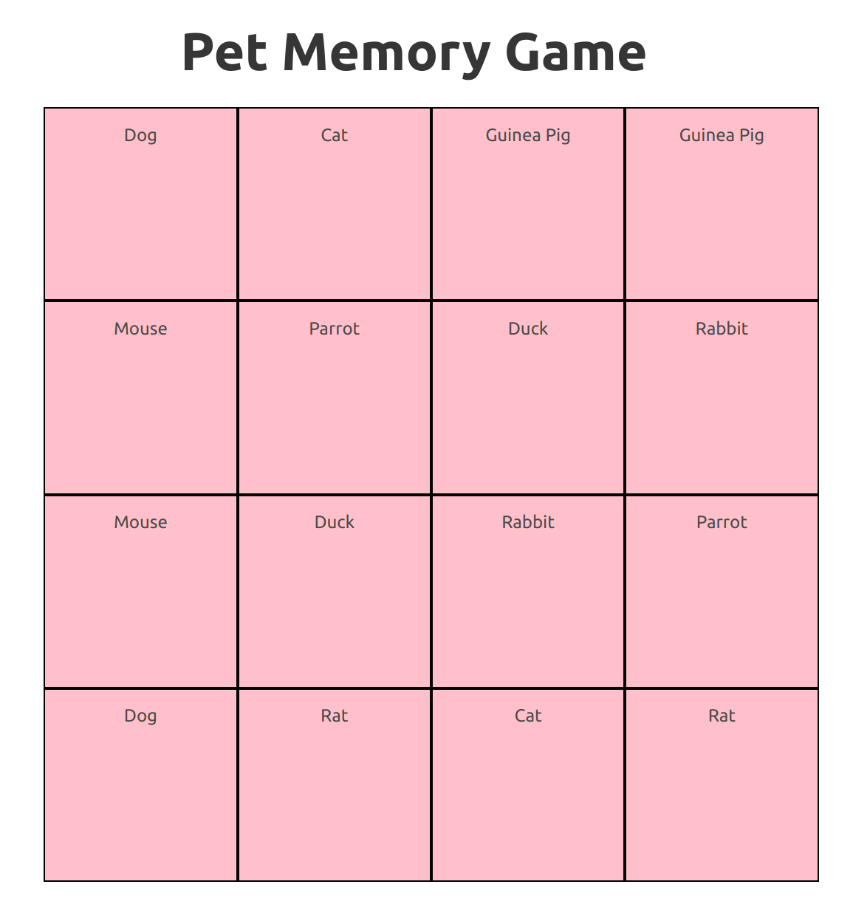

# Pet Memories

For this challenge, you'll be making a basic Memory Game!

There is a grid of randomly arranged pairs. The end goal is to have each _cell_ start hidden, and become visible temporarily when you select it. When you have revealed a _pair_ of cells with the same value, you have found a match, and that pair should stay revealed for the rest of the game. If you reveal 2 cells that are NOT a match, they should flip back to being hidden. The Game is won when all pairs have been matched.


## Setup

After cloning this repo

```sh
yarn
yarn start
```

and then go to [`http://localhost:3000`](http://localhost:3000).

This is what your starting place looks like:




## How you might think about finishing the game

1. First, look through the existing code and make sure you understand _all_ of it. If you see something unexpected or confusing, be sure you understand before proceeding.

2. Make all of the cells start out hidden. If you have a look at `createCell` in `createBoard.js` you'll notice that each cell object has already been designated as hidden, but the code in the `Cell` component isn't recognising that property on the `cell` object. Consider the `&&` operator to only show the cell's value when `cell.isVisible` is `true`.

3. Make a cell respond to a click event. Because you should maintain state in the `Board` component, your event handler should live in `Board` component, but should be passed as a prop to the `Cell` component.

_to be continued_


## The requirements

* All cells should **start** hidden, and be **revealed** upon a click event.

* When a user has selected 2 cells to reveal, your app must find whether the pair are a **match** or not. A match will stay revealed, a non-match will be hidden again.

* When all pairs are revealed, the user is informed that they have won, and may restart the game.


## Some things to consider

When the 2nd cell is revealed and found to not be a match, you will want to inform the user that they didn't find a match. It would also be sensible to try and give the user several seconds to see their mismatched picks (on a `setTimeout`), or allow the user to confirm (with a button) when they are ready to try again.

How do you know which cells are being **temporarily** revealed? How do you know which cells are **permanently** revealed?

Do you store or information in the **cell** objects, or separately within the Board.jsx components **state**?


## Resources

If you don't already have it installed, you should install the React DevTools browser extension ([Firefox](https://addons.mozilla.org/en-US/firefox/addon/react-devtools/) and [Chrome](https://chrome.google.com/webstore/detail/react-developer-tools/fmkadmapgofadopljbjfkapdkoienihi?hl=en)). This will add a tab in Developer Tools that will allow you to explore the [virtual DOM](http://tonyfreed.com/blog/what_is_virtual_dom) used by React.

And some more:

* [React Component](https://facebook.github.io/react/docs/reusable-components.html#es6-classes)
* [React Component API](https://facebook.github.io/react/docs/component-api.html)
* [How State Works](https://facebook.github.io/react/docs/interactivity-and-dynamic-uis.html#how-state-works)
* [React's `setState`](https://facebook.github.io/react/docs/component-api.html#setstate)
* [React Event Handling](https://facebook.github.io/react/docs/interactivity-and-dynamic-uis.html#a-simple-example)
* [`ReactDOM.render`](https://facebook.github.io/react/docs/top-level-api.html#reactdom.render)
* [React TestUtils](https://facebook.github.io/react/docs/test-utils.html)
